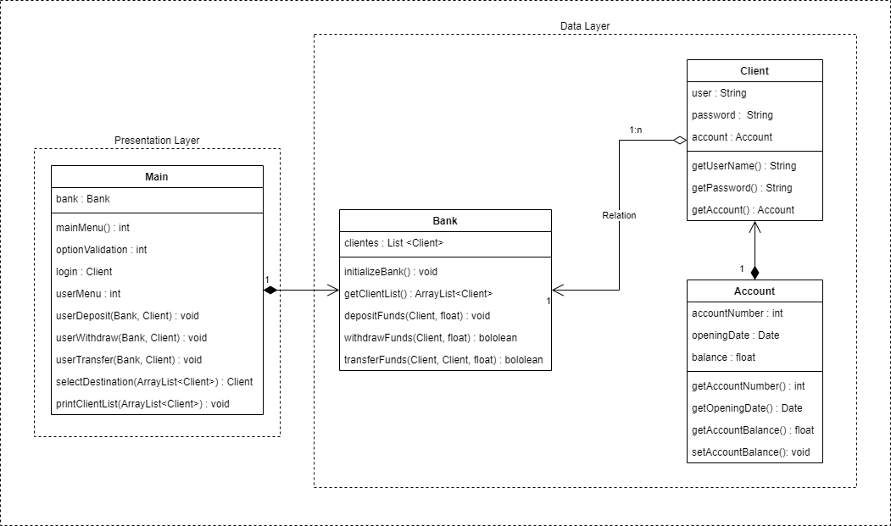

## GLOBANT BANK

### PROJECT DESCRIPTION

#### OBJECTIVE
Globant Bank needs to make a system for their users to make transactions with their savings
accounts.

#### RULES

<ul>
	<li>The bank has many users, so there should be an option to print all clients and their related
information.</li>
	<li>Each client has a savings account, an user and a password</li>
	<li>Each bank account has an account number, an opening date and a balance.</li>
	<li>The user should be able to make a withdraw, add money, and transfer money to another bank
account</li>
	<li>Some transactions are taxed.</li>
</ul>

#### TAXATION RULES

<ul>
	<li>Adding money to the account does not have any cost.</li>
	<li>Withdrawals tax is $200 for amounts less than $1000. Withdrawals of more than $1000
tax is $200 plus 15% of the amount to withdraw.</li>
	<li>Transfering money to another account tax is $100.</li>
</ul>

### PROJECT STRUCTURE

### SCOPE

Even though the project is developed to follow the given rules, the project is scalable, which means that with very few changes, every client could be allowed to have more than one account and transactions between different banks could be implemented.

The current client class may be too simple and can be improved to provide better access control to the application, the account class can also include more information for future features.

The app does not include an admin profile, for this reason the main class includes a method to initialize the database with 6 predefined users, however, clients may be created using the client class constructor if an admin panel is implemented.